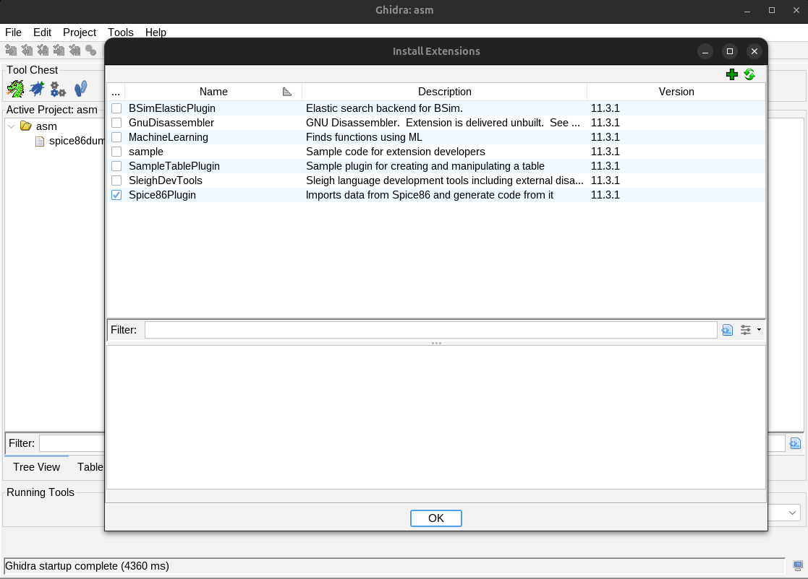

# Spice86 Ghidra Plugin
## What it is
- Imports Spice86 data into Ghidra
- Generates C# code from the imported data (this feature is currently broken and is being moved to spice86 directly)

Everything is under the new menu Spice86 that you will get after installing the plugin
## Requirement
- Java 21
- Ghidra 11.3.1_PUBLIC (Other versions are not guaranteed to work)

## Building the plugin
Prerequisites:
- Create an environment variable pointing to you ghidra local install called GHIDRA_INSTALL_DIR. Example: GHIDRA_INSTALL_DIR=/home/kevin/ghidra_11.3.1_PUBLIC
- Install JDK 21
- Install Gradle 8.13 or above

Run the following command in a terminal of your choice.
```
gradle buildExtension
```
Upon completion the output will be located in the dist folder.

## Deploying the plugin in ghidra
Plugin must built for your ghidra version and initially installed via ghidra UI.

To do so:
 - Open File -> Install Extensions
 - Click on + and add the zip that got built in the dist folder (example file name ghidra_11.3.1_PUBLIC_20250305_spice86-ghidra-plugin.zip)



Then restart ghidra.

You should see plugin files under ~/.config/ghidra/ghidra_11.3.1_PUBLIC/Extensions/spice86-ghidra-plugin

You should now have a Spice86 menu in ghidra.

## Updating the plugin
For updates, sometimes ghidra doesn't like a plugin being redeployed over and over via the UI, and it can happoen that latest version you deployed is not the one actually being deployed.

So when you do changes, you can alternatively just redeploy the jar to the correct folder and restart ghidra.

Here is what I added to my .zshrc to do it:
```
export GHIDRA_VERSION="11.3.1_PUBLIC"
alias deployghidra='unzip -of dist/ghidra_${GHIDRA_VERSION}_`date +"%Y%m%d"`_spice86-ghidra-plugin.zip -d dist && cp dist/spice86-ghidra-plugin/lib/* ~/.config/ghidra/ghidra_${GHIDRA_VERSION}/Extensions/spice86-ghidra-plugin/lib/'
```
Then once build is done simply type deployghidra

For reference, here is the [ghidra dev guide](https://github.com/NationalSecurityAgency/ghidra/blob/master/DevGuide.md)

## Debug the plugin
Some references: https://reversing.technology/2019/11/18/ghidra-dev-pt3-dbg.html
You need to start ghidra in jvm debug mode:
```bash
./support/ghidraDebug
```

Note the port in the output (in this case 18001)
```
Listening for transport dt_socket at address: 18001
...
```

In intellij, connect to this port and put breakpoints in the plugin code.

## Testing the plugin
The script in ci/testRunner can be used locally to test new builds of the plugin.

It works by running various binaries in emulated and generated mode:
- Spice86 vanilla is run for each binary, and run data are collected
- The plugin is called with the run data to generate code
- Generated code is built and run, run data are collected
- Emulated and geneated code ram are compared, if there is any difference the script stops.

Before you run it you need:
- Spice86 compiled somewhere
- Ghidra installed
- The plugin installed in Ghidra (Until I figure out how to do a headless plugin install :) )
- The spice86 cpu tests somewhere

Example run:
```
./ci/testRunner \
--spice86Exe=/path/to/spice86exe/Spice86 \
--testBinRoot=/path/to/cpuTests/ \
--ghidraHome=/path/to/ghidra_11.3.1_PUBLIC/ \
--scriptPath=/path/to/spice86-ghidra-plugin/src/main/java/
```

If you specify a folder to --workspace, the script will run there, otherwise it will create a temp folder.

If you don't want it to update the spice86 template from nuget (used to generate a project for generated code), you can say so by specifying --skipTemplateUpdate=true